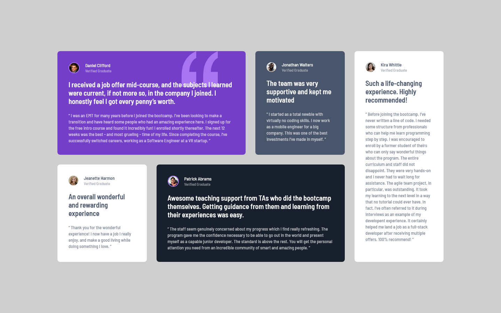

# Frontend Mentor - Testimonials grid section solution

This is a solution to the [Testimonials grid section challenge on Frontend Mentor](https://www.frontendmentor.io/challenges/testimonials-grid-section-Nnw6J7Un7). Frontend Mentor challenges help you improve your coding skills by building realistic projects. 

## Table of contents

- [Overview](#overview)
  - [The challenge](#the-challenge)
  - [Screenshot](#screenshot)
  - [Links](#links)
- [My process](#my-process)
  - [Built with](#built-with)
  - [Useful resources](#useful-resources)
- [Author](#author)

## Overview

### The challenge

Users should be able to:

- View the optimal layout for the site depending on their device's screen size

### Screenshot

### Links

- Solution URL: [GitHub - GrzywN](https://github.com/GrzywN/testimonials-grid-section-main)
- Live Site URL: [Netlify](https://tender-leavitt-30eb2f.netlify.app/)

## My process

### Built with

- Semantic HTML5 markup
- CSS custom properties
- SASS/SCSS preprocessor
- CSS animations/transitions
- Flexbox / CSS Grid
- Desktop-first workflow

### Useful resources

- [Grid Garden](https://cssgridgarden.com/) - This is great resource to learn Grid. It helped me understanding the CSS grid and making more advanced layouts with it. 

## Author

- Frontend Mentor - [@GrzywN](https://www.frontendmentor.io/profile/grzywn)
- Twitter - [@grzywn](https://www.twitter.com/grzywn)
